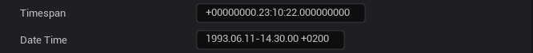
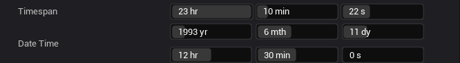

<!-- markdownlint-disable-next-line -->
<p align="center">
  <a href="#" rel="noopener" target="_blank"></a>
</p>

<h1 align="center">CommonTime [Unreal Engine]</h1>

<div align="center">

*Provides an editor view for editing DateTime and Timespan values.*
  
[](https://github.com/mrrobinofficial/unreal-commontime/blob/HEAD/LICENSE.txt)


</div>

#

## 📋 TODO

* Fix padding issue (not prioritize)

## ⚙️ Supported Platforms
This plug-in was last built against Unreal Engine 5.3.

## ⚒️ Installation

You can install from the <a href="https://github.com/MrRobinOfficial/Unreal-CommonTime/releases/latest">release section</a>.

Alternatively, you can install this plugin via terminal with [*git*](https://git-scm.com/). **Here is the command for installing it**.

```console
git clone git@github.com:MrRobinOfficial/Unreal-CommonTime.git CommonTime
```

#

<details open> 
    <summary><h2>🖼️ Screenshots</h2></summary>
    From this:
    
    To this:
    
</details>

#

## 🆘 Support
If you have any questions or issue, just write either to my [YouTube channel](https://www.youtube.com/@mrrobinofficial), [Email](mailto:mrrobin123mail@gmail.com) or [Twitter DM](https://twitter.com/MrRobinOfficial).
